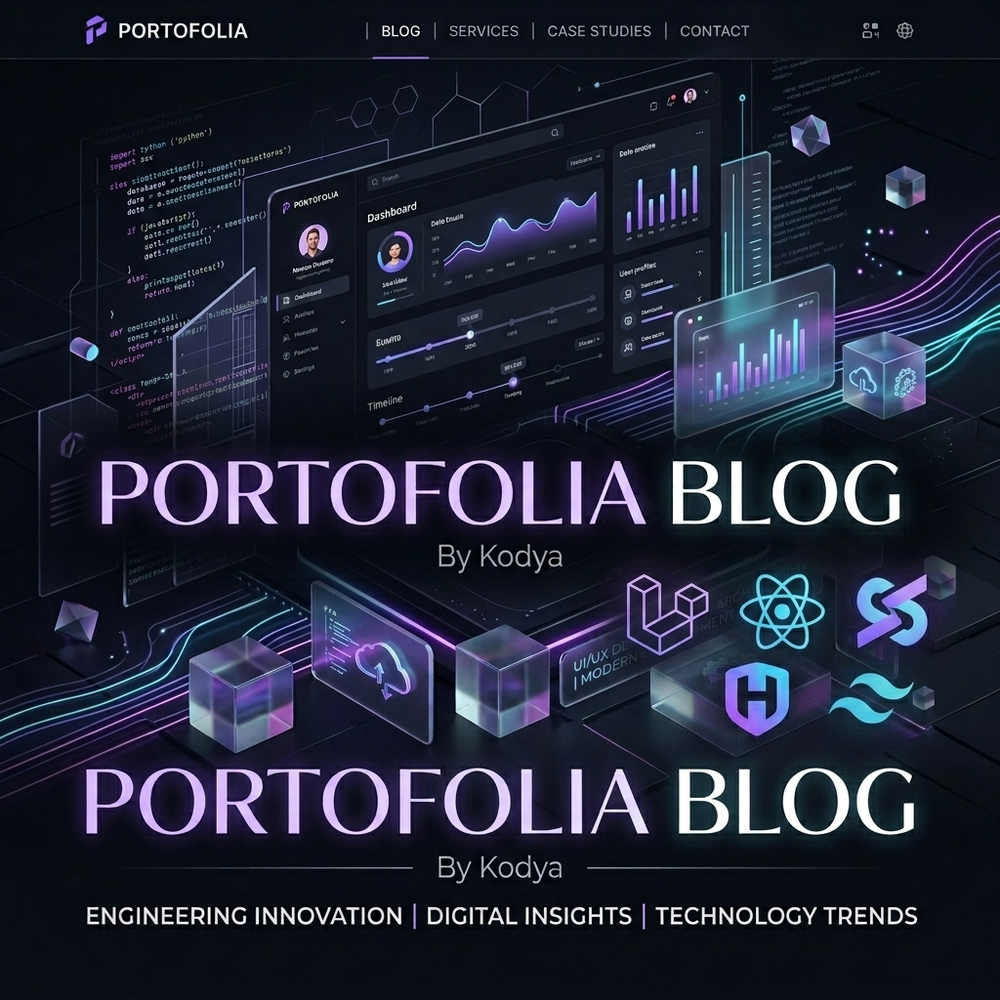

# Portofolia Blog by Kodya - Website Profil Perusahaan



Sebuah website profil perusahaan yang premium, modern, dan sangat responsif, dibangun dengan menggunakan **Laravel 13**, **React 19**, **Inertia.js v3**, **HeroUI v3** (sebelumnya NextUI), dan **Tailwind CSS v4**.

---

## 🚀 Fitur Utama

*   **Header & Footer Responsif**: Navigasi sticky yang bersih dengan logo kustom (`Logo2.png`), pintasan sosial media, indikator halaman aktif, dan tombol aksi "Hubungi Kami" yang mengarah langsung ke formulir kontak.
*   **Mode Gelap/Terang yang Halus**: Integrasi hook tampilan untuk deteksi mode gelap sistem secara otomatis dengan transisi perpindahan tema yang halus.
*   **Visi, Misi, dan Profil Tim**: Layout grid yang premium menampilkan Visi, Misi, Nilai Utama Perusahaan, dan biografi singkat tim kepemimpinan.
*   **Katalog Layanan & Metodologi**: Informasi lengkap tentang layanan teknik (Pengembangan Web, Aplikasi Mobile, Cloud/DevOps, Strategi UI/UX) lengkap dengan visualisasi alur metodologi kerja.
*   **Galeri Portofolio Interaktif**: Kartu proyek case study yang dilengkapi filter kategori dinamis (Semua, Web, Mobile, DevOps, Desain) dan animasi hover yang premium.
*   **Formulir Inquiry Kontak & Peta**: Hubungi kami secara instan dengan formulir inquiry yang memiliki animasi loading (state `isPending` dan `Spinner` dari HeroUI), detail kontak, serta visual penanda (beacon) lokasi kantor pusat.

---

## 🛠️ Teknologi yang Digunakan

*   **Backend Utama**: PHP 8.4 + [Laravel 13](https://laravel.com/)
*   **Frontend Utama**: React 19 + TypeScript + [Inertia.js v3](https://inertiajs.com/)
*   **Library Komponen**: [HeroUI v3](https://heroui.com/)
*   **Sistem Styling**: [Tailwind CSS v4](https://tailwindcss.com/)
*   **Penyedia Router**: [Laravel Wayfinder](https://github.com/laravel/wayfinder)
*   **Linter & Formatter**: [Laravel Pint](https://github.com/laravel/pint) + ESLint + Prettier

---

## 💻 Memulai

Ikuti langkah-langkah di bawah ini untuk menjalankan aplikasi di komputer lokal Anda.

### Prasyarat
Pastikan komputer Anda sudah terinstal:
*   **PHP >= 8.4**
*   **Composer**
*   **Node.js & npm**

### Instalasi

1.  **Clone Repositori**:
    ```bash
    git clone https://github.com/kodyaa/blog-profile.git
    cd blog-profile
    ```

2.  **Instal Dependensi PHP**:
    ```bash
    composer install
    ```

3.  **Instal Dependensi Node**:
    ```bash
    npm install
    ```

4.  **Konfigurasi Environment**:
    Salin berkas konfigurasi contoh:
    ```bash
    cp .env.example .env
    ```
    Buat kunci enkripsi aplikasi:
    ```bash
    php artisan key:generate
    ```

---

## ⚙️ Menjalankan di Lokal

### Server Pengembangan
Jalankan server Laravel dan builder Vite secara bersamaan:
```bash
npm run dev
# ATAU jalankan manual di dua terminal terpisah:
# php artisan serve
# npm run dev
```

Aplikasi dapat diakses melalui browser di alamat lokal (biasanya `http://127.0.0.1:8000`).

### Format Kode (Linting)
Pastikan gaya penulisan kode sesuai standar proyek:
```bash
vendor/bin/pint --dirty --format agent
npm run format
```

### Validasi TypeScript
Periksa kesesuaian tipe data dan properti komponen:
```bash
npm run types:check
```

### Build Produksi
Kompilasi dan perkecil ukuran aset client untuk kebutuhan hosting/produksi:
```bash
npm run build
```
