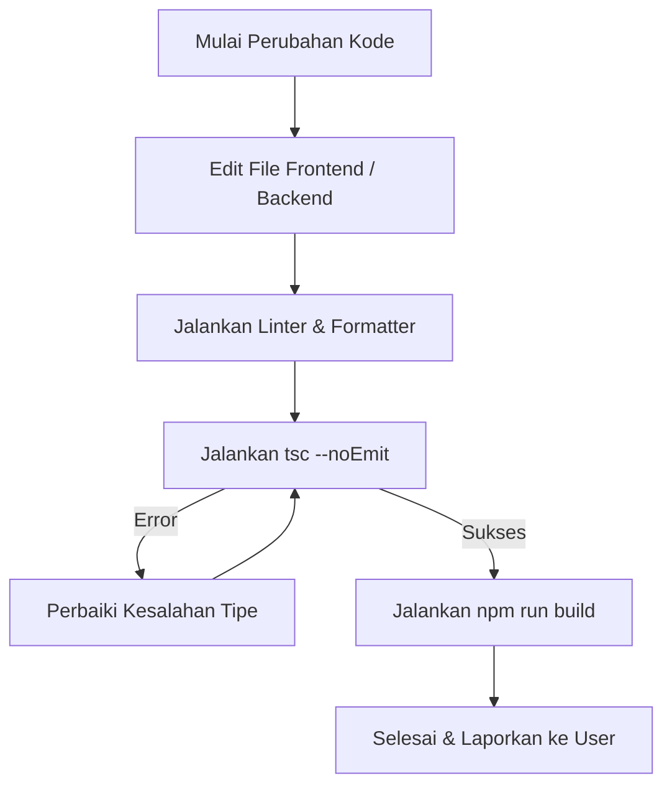

# Alur Kerja Agen AI & Automasi - Portofolia Blog by Kodya

Dokumen ini ditujukan untuk **Agen AI Coding (seperti Antigravity)** atau developer otomatisasi yang memelihara codebase ini. Panduan ini memastikan modifikasi di masa mendatang mematuhi aturan integrasi yang tepat.

---

## 1. Aturan Dasar untuk Agen AI

### A. Evaluasi Awal (MANDATORY)
*   Sebelum menulis kode atau memodifikasi file backend/frontend, Agen AI harus memeriksa instruksi desain di [AGENTS.md](file:///d:/Windows%20App/Laravel/blog/AGENTS.md) dan detail skill di `.agents/skills/`.
*   Semua perubahan antarmuka pengguna (UI) wajib menggunakan **HeroUI v3** dan **Tailwind CSS v4**.

### B. Prosedur Modifikasi File



---

## 2. Automasi & Perintah Utama

Setiap kali Agen AI memodifikasi script, perintah-perintah berikut wajib dieksekusi secara berurutan:

1.  **Format PHP**:
    Jalankan Laravel Pint untuk memformat sintaks PHP backend:
    ```bash
    vendor/bin/pint --dirty --format agent
    ```
2.  **Format JavaScript/TypeScript**:
    Rapikan file `.tsx` dan `.ts` menggunakan Prettier:
    ```bash
    npm run format
    ```
3.  **Pengecekan Tipe Data (TypeScript)**:
    Pastikan tidak ada kesalahan kompilasi tipe data:
    ```bash
    npm run types:check
    ```
4.  **Verifikasi Build**:
    Pastikan bundler Vite dapat mengompilasi semua file halaman dengan sukses:
    ```bash
    npm run build
    ```

---

## 3. Batasan Desain & Konvensi
*   **Tanpa Placeholder**: Agen AI dilarang menulis path kosong atau file placeholder. Semua deskripsi proyek, nama anggota tim, dan nomor kontak harus tertulis secara realistis dan informatif.
*   **Navigasi Global**: Semua halaman baru wajib diintegrasikan ke dalam [public-layout.tsx](file:///d:/Windows%20App/Laravel/blog/resources/js/layouts/public-layout.tsx) agar dapat diakses pengunjung dengan mudah.
