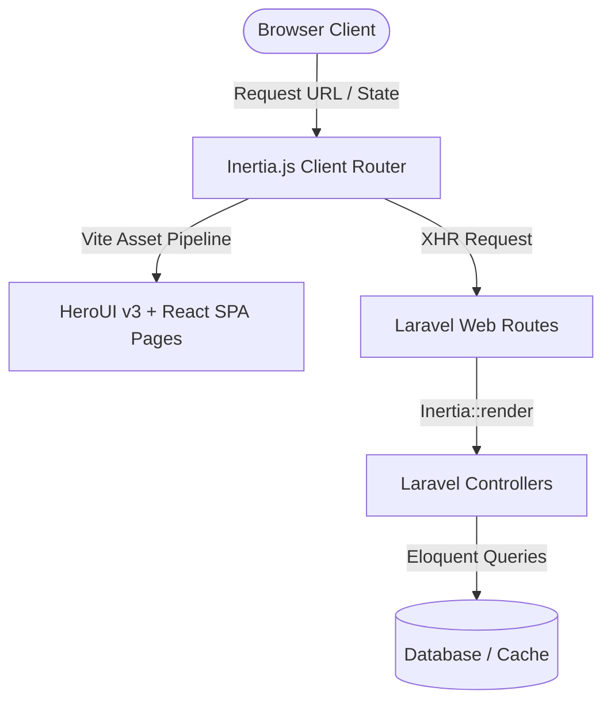

# Arsitektur Sistem - Portofolia Blog by Kodya

Website ini menggunakan pola **Monolit Modern (Modern Monolith)** yang memisahkan frontend (React SPA) dan backend (Laravel) dalam satu repositori tunggal menggunakan **Inertia.js** sebagai jembatan komunikasi.

---

## 1. Diagram Komponen Arsitektur

---

## 2. Deskripsi Layer

### A. Frontend Layer (Client-Side)
*   **React 19 & TypeScript**: Mengelola rendering UI, state local halaman, dan manipulasi DOM.
*   **HeroUI v3**: Digunakan untuk rendering komponen-komponen UI yang aksesibel (seperti `Card`, `Button`, `Input`, `TextArea`, `Spinner`) berbasis standar React Aria.
*   **Tailwind CSS v4**: Mengelola framework utility styling yang responsif dengan performa tinggi.
*   **Asset Bundler (Vite)**: Mengompilasi dan mengoptimalkan kode JavaScript/CSS melalui kompresi otomatis dan pembagian chunks.

### B. Communication Bridge Layer (Inertia.js)
*   **Inertia.js v3**: Menghubungkan client-side routing dengan server-side routing. Ketika tautan diklik, Inertia memotong request default browser dan melakukan request AJAX khusus (XHR) untuk meminta data JSON halaman berikutnya, lalu mengganti state UI tanpa memuat ulang browser penuh (Full SPA Feel).
*   **Laravel Wayfinder**: Menghasilkan fungsi TypeScript otomatis (`@/actions/` atau `@/routes/`) dari route Laravel agar koneksi URL di frontend bertipe data aman (Type-Safe).

### C. Backend Layer (Server-Side)
*   **Laravel 13 & PHP 8.4**: Bertugas menerima request, memproses otorisasi, mengelola log, konfigurasi, dan me-render respon melalui fungsi `Inertia::render()`.
*   **Fortify Config**: Bertindak sebagai modul backend, dinonaktifkan seluruh fiturnya agar aplikasi berstatus *public read-only* (tidak ada otorisasi database yang terbuka).

---

## 3. Alur Request-Response

1.  Browser melakukan request awal ke alamat website (misal: `/services`).
2.  Laravel Router mencocokkan route dan memanggil handler yang mengirimkan response template Blade dasar (`app.blade.php`).
3.  Vite me-mount aplikasi React ke elemen `
`.
4.  Jika user menekan link menu navigasi (misal: "Portfolio"), **Inertia.js** melakukan intercept request dan mengirimkan request AJAX ke server.
5.  Server merespon dengan data JSON berisi nama komponen halaman (`portfolio`) dan properti terkait (props).
6.  Inertia.js menerima respon tersebut dan merender ulang halaman client secara dinamis.
