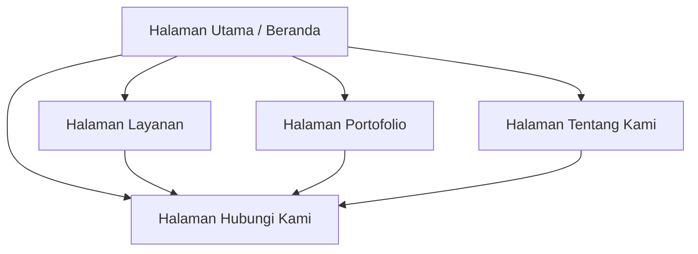

# Alur Kerja & Navigasi Pengguna - Portofolia Blog by Kodya

Dokumen ini menjelaskan alur interaksi pengguna (User Flow) saat menjelajahi website profil perusahaan ini.

---

## 1. Peta Navigasi Halaman (Sitemap)

---

## 2. Alur Pengalaman Pengguna (User Journey)

### A. Tahap 1: Land (Halaman Beranda)
*   Pengunjung pertama kali masuk ke halaman utama (`/`).
*   Pengunjung disuguhi dengan **Hero Section** yang menjelaskan core business secara singkat.
*   Pengunjung melihat **Statistik Utama** perusahaan (jumlah proyek, tingkat kepuasan, dll.) untuk membangun kredibilitas awal.
*   Pengunjung dapat mengklik tombol **"Explore Services"** untuk dialihkan ke halaman katalog layanan, atau scroll ke bawah untuk melihat sekilas portofolio unggulan.

### B. Tahap 2: Evaluasi Kompetensi (Layanan & Portofolio)
*   Pengunjung mempelajari kapabilitas teknis di `/services`.
*   Pengunjung melihat bukti fisik pengerjaan proyek di `/portfolio`. Di sini, pengunjung bisa memfilter portofolio berdasarkan platform (Web, Mobile, DevOps, Desain) untuk mencari case study yang relevan dengan kebutuhan mereka.

### C. Tahap 3: Validasi Profil (Tentang Kami)
*   Untuk memvalidasi integritas perusahaan, pengunjung membuka halaman `/about`.
*   Pengunjung membaca **Visi & Misi** perusahaan serta mempelajari keahlian dari profil anggota **Tim Utama**.

### D. Tahap 4: Konversi (Hubungi Kami)
*   Setelah yakin, pengunjung mengklik tombol **"Get in Touch"** di header navigasi atau membuka `/contact`.
*   Pengunjung mengisi formulir inquiry bisnis.
*   Selama formulir dikirim, tombol berubah menjadi state loading (`isPending` + `Spinner`) untuk mencegah double-submission.
*   Setelah berhasil terkirim, state beralih ke tampilan sukses (**CheckCircle icon**) dan detail kontak dikirimkan secara mock ke perwakilan bisnis.
